# Praktikum 12: API

```bash
Nama    : Savariana Rika Anugrahaini
Kelas   : TI.21.A.3
Nim     : 312110052
```

## Output

```bash
API menggunakan Framework Codeigniter 4.
```

## Menu Admin

1. Sign In u/ Admin

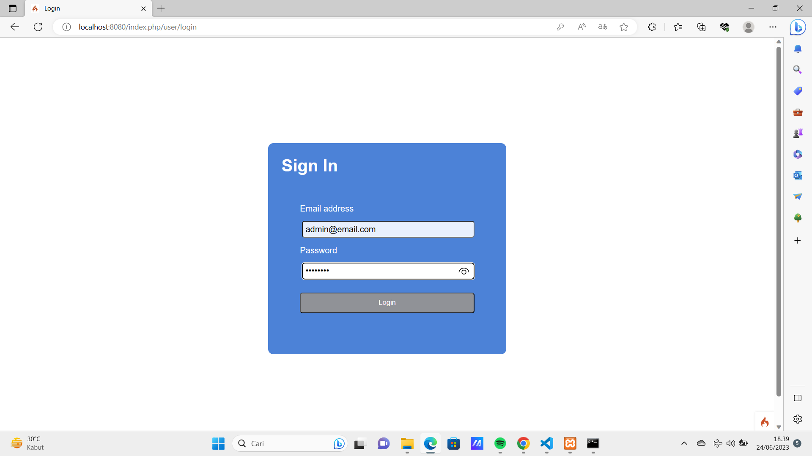

2. Halaman Artikel Admin

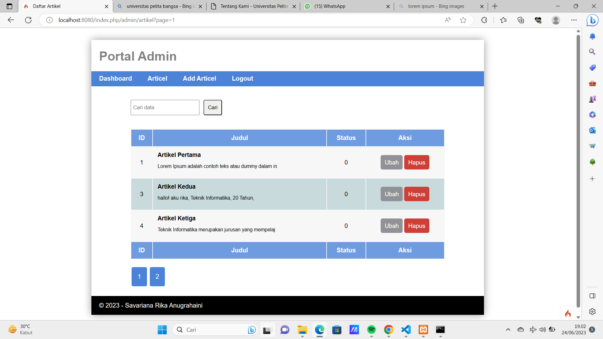

3. Pencarian Data Artikel

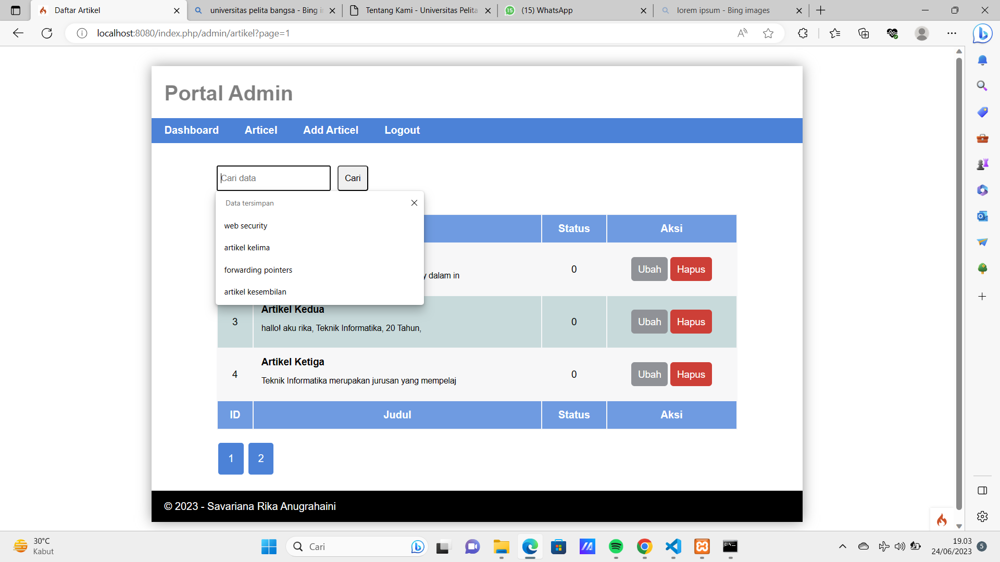

4. Contoh Pencarian Data

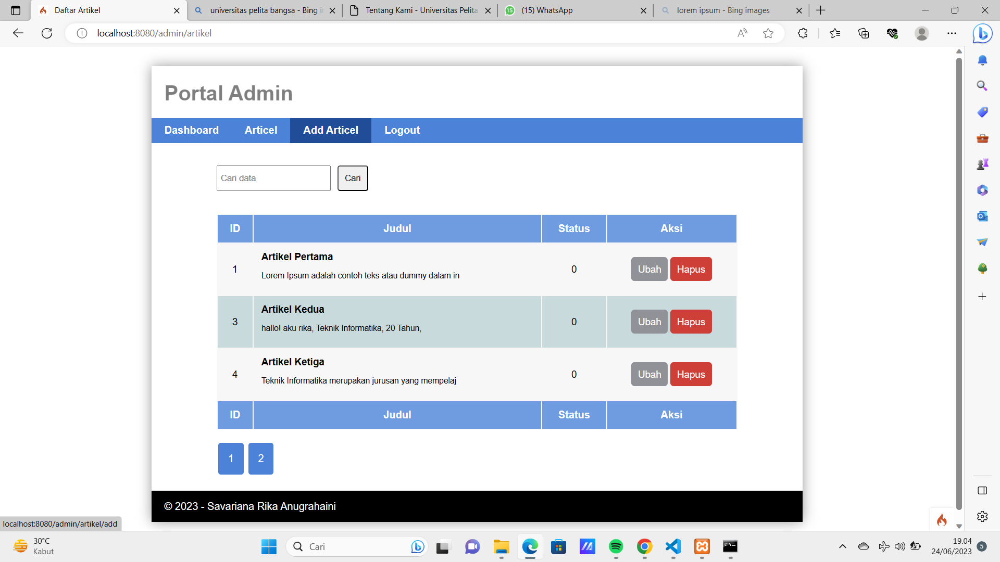

5. Tampilan Penambahan Artikel Terbaru dengan Tampilan Upload Gambar

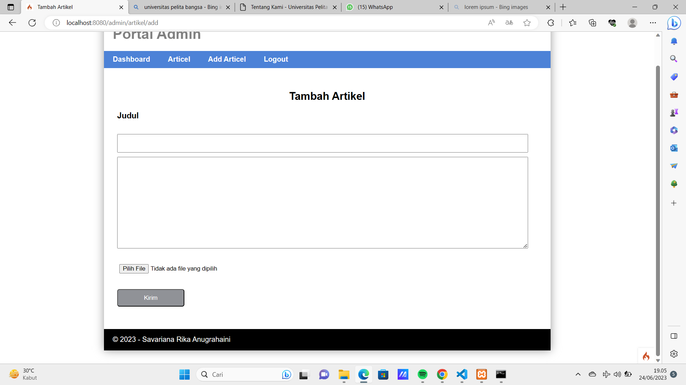

6. Tampilan Ubah Artikel Terbaru dengan Tampilan Upload Gambar

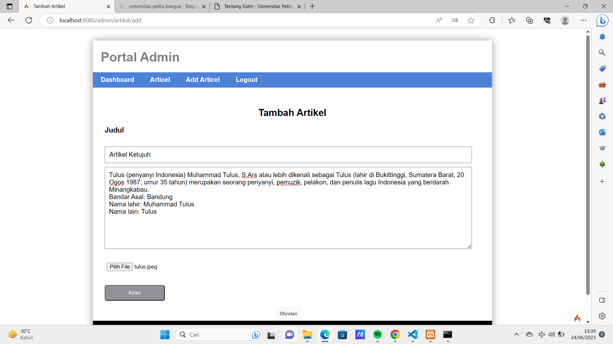

7. Hapus Artikel

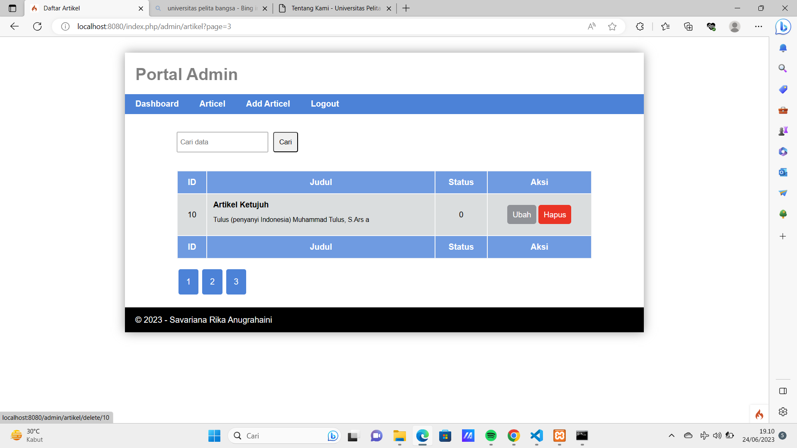


## Menu User

1. Home Terbaru

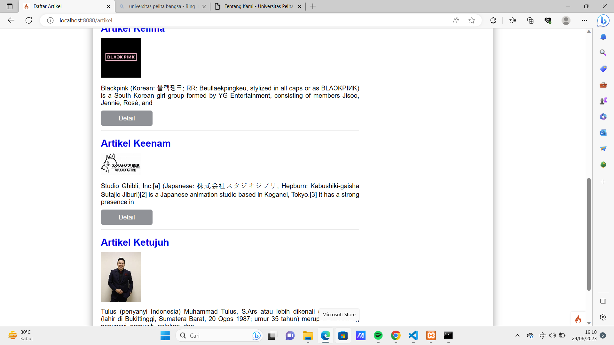

2. Detail Terbaru

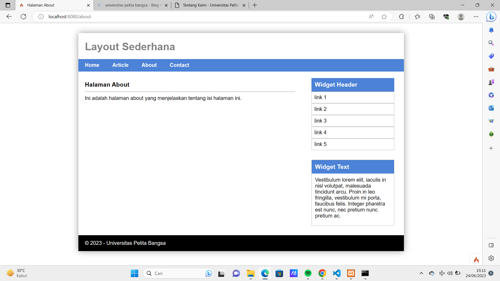


## REST API

REST API berisi aturan untuk membuat web service dengan membatasi hak akses client
yang mengakses API.

1. Menampilkan Semua Data dengan Method GET

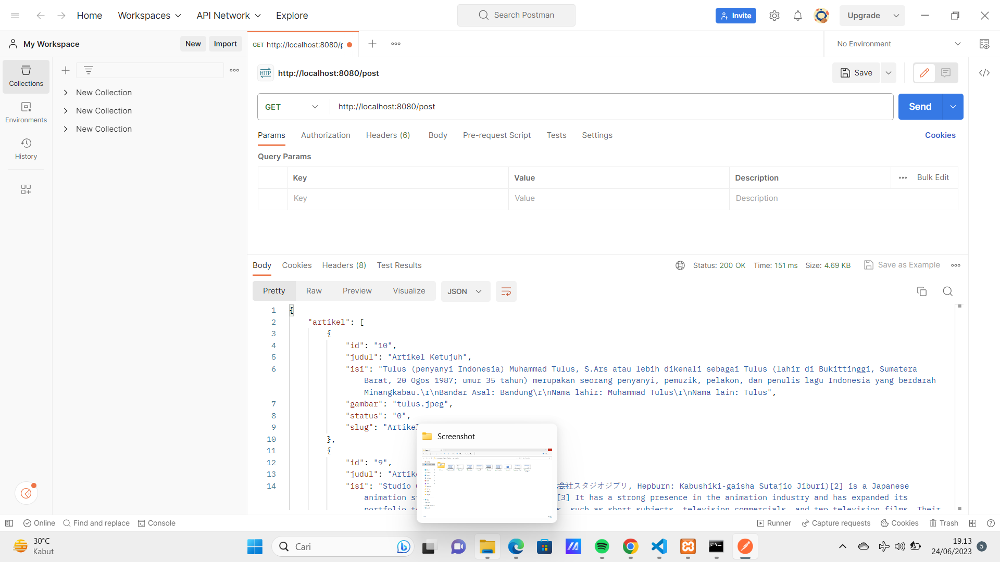

2. Menampilkan Data Spesifik 

- Mencari data dengan id 1

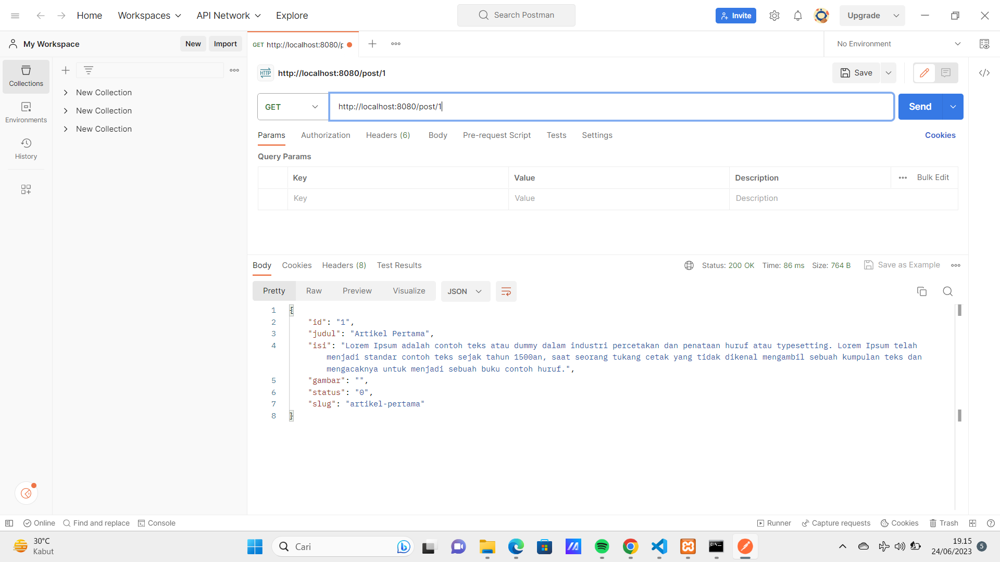

3. Mengubah Data dengan Method Put

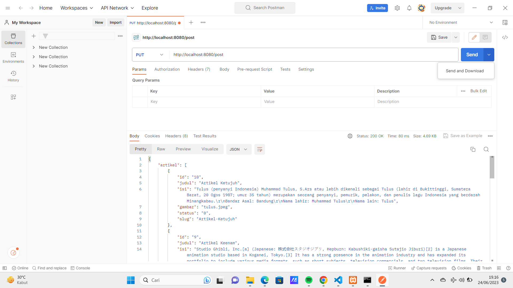

4. Menambahkan Data dengan Method Post

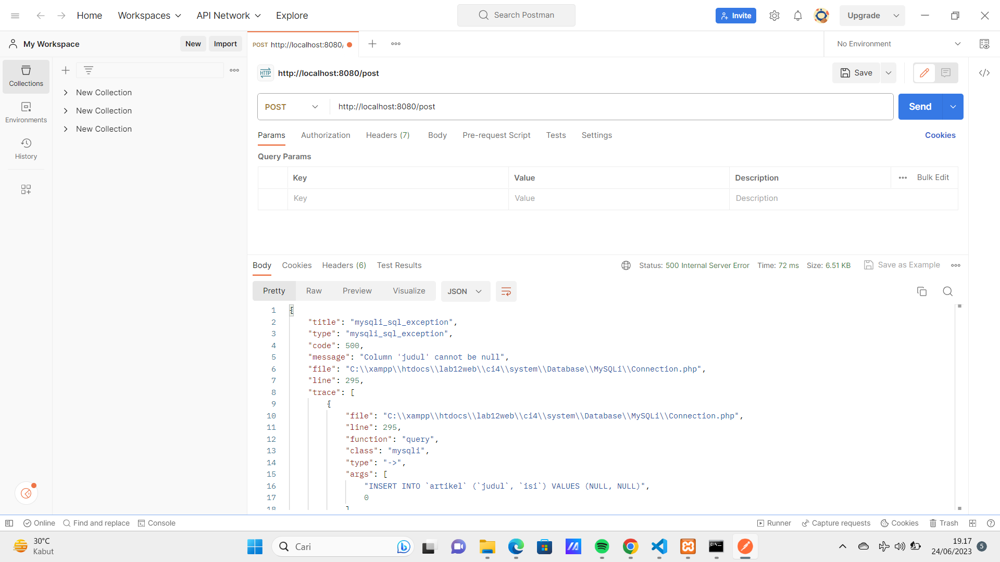

- Tampilan saat melihat semua data dengan method get. Akan terlihat dengan id 1

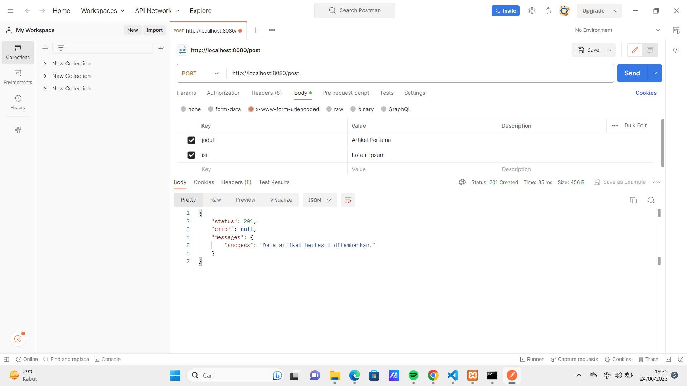

5. Menghapus Data dengan Method Delete

- Menghapus data dengan id 1

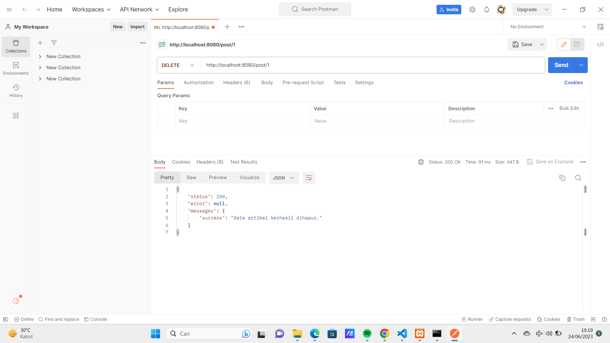

- Tampilan saat melihat semua data dengan method get. Maka id 25 akan hilang/terhapus

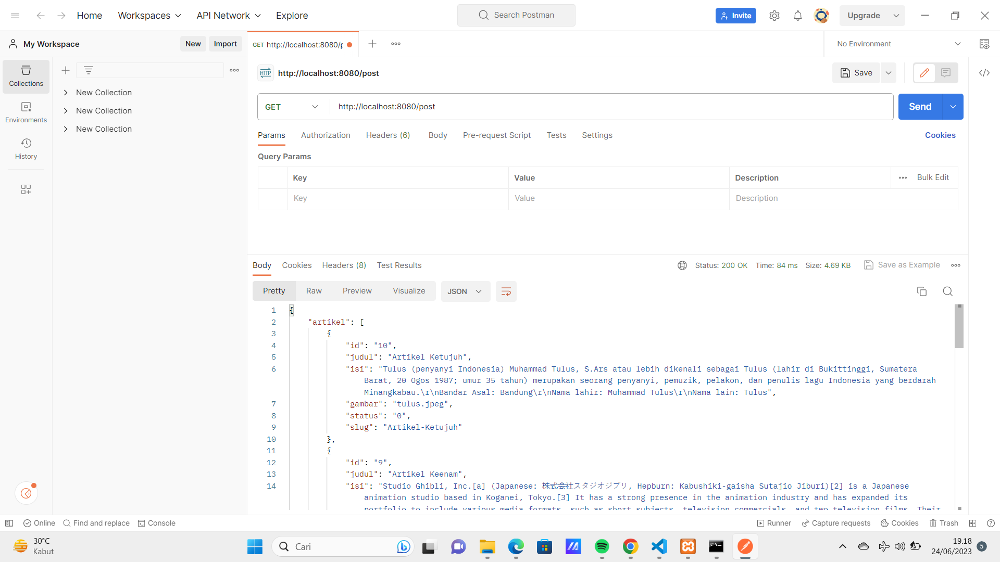


## Arigato Minasan!(●'◡'●)